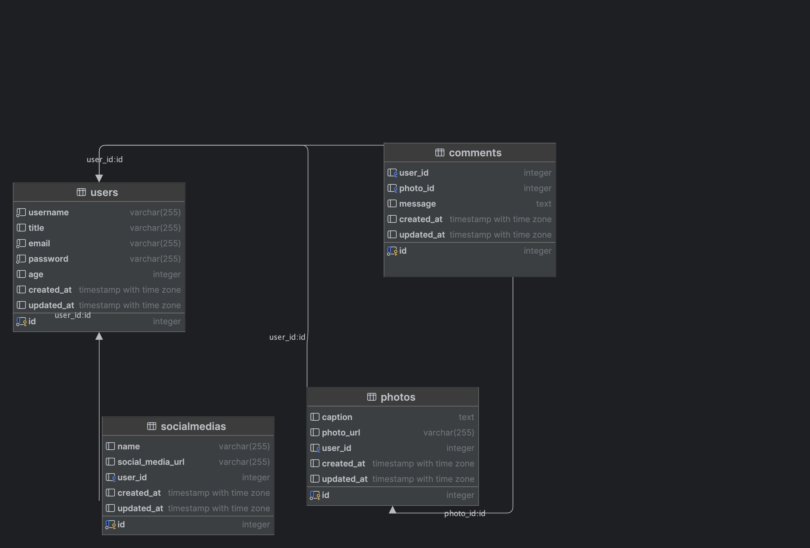

# Hacktiv8 Final Assignmet - Indra Octama

About crud data order and items

## Prerequisites
- Go (1.22 or higher)
- Gorm
- Docker
- Make
- Git

## Makefile Commands

- `make init`: Go module.
- `make run`: Start the API server without docker.
- `make run-docker`: Start the API server with docker.

## Database Design
